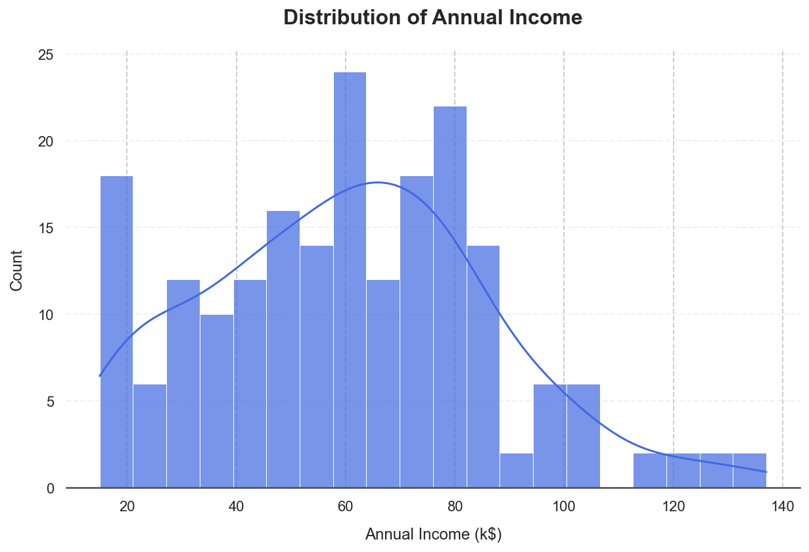
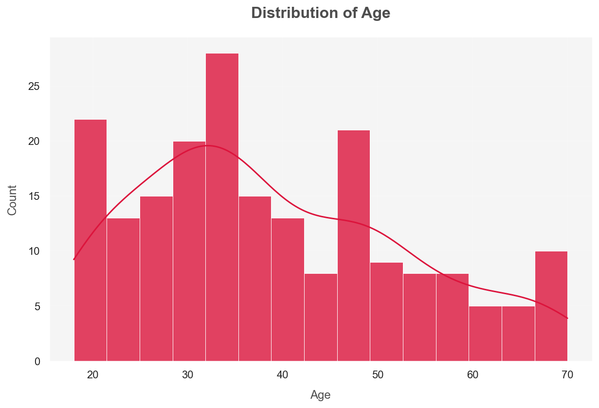
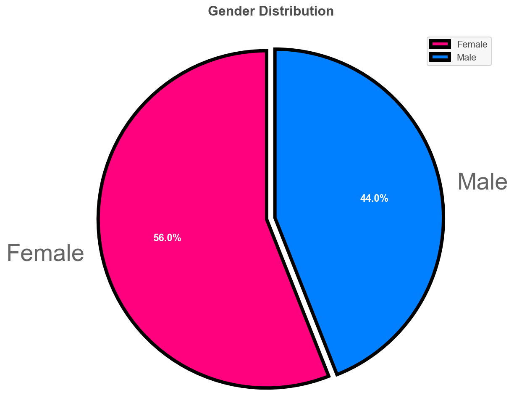
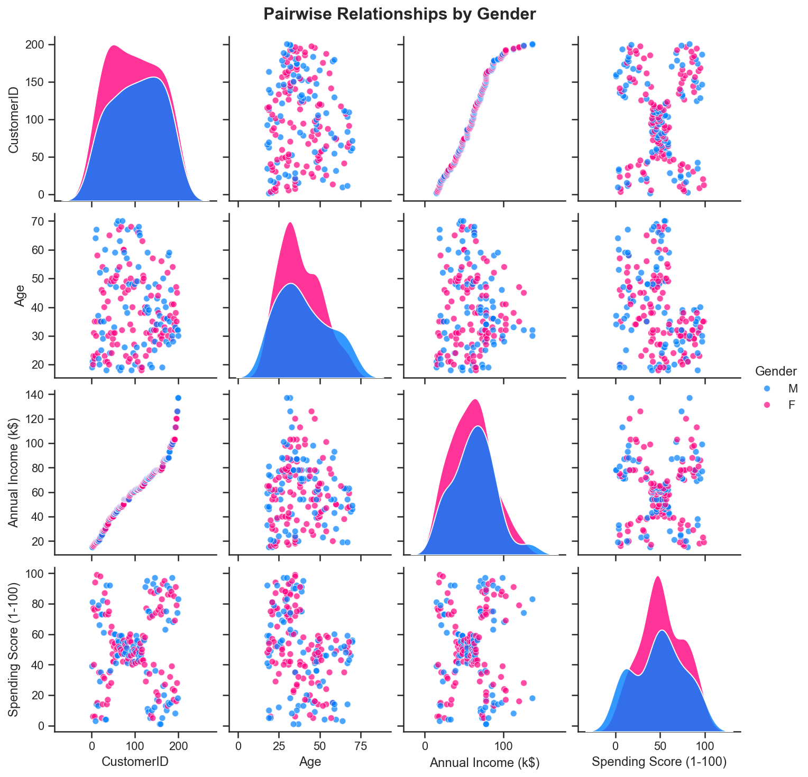
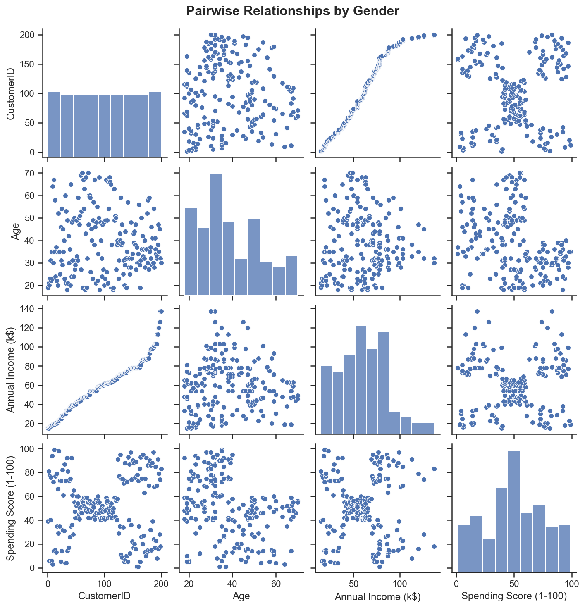
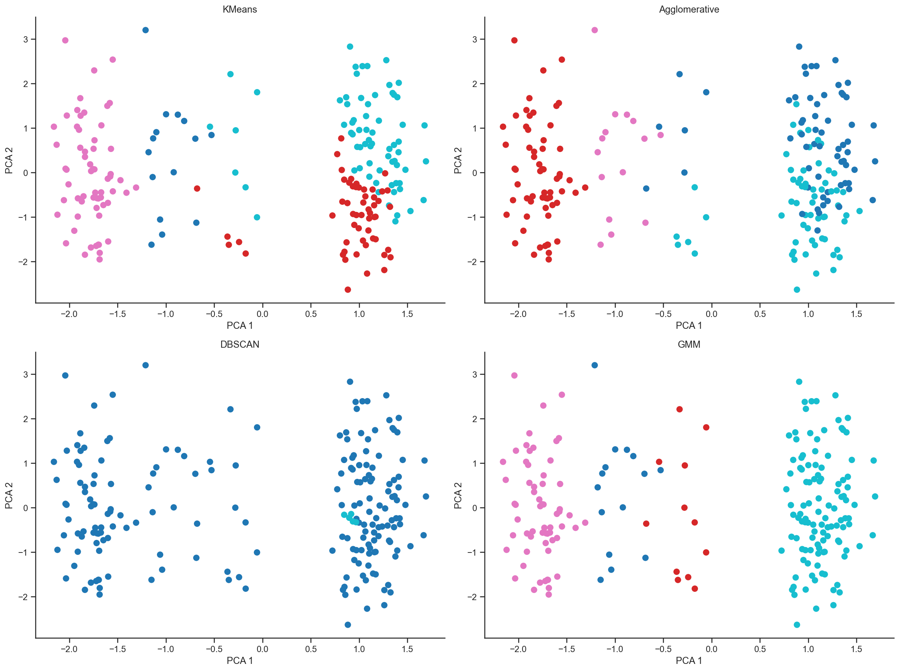

# 🧠 Customer Segmentation with Clustering Techniques

This project focuses on segmenting mall customers based on demographics and behavior using clustering algorithms. It includes visual exploration, data preprocessing, and application of multiple clustering techniques for comparison.

---

## 📈 Business Context

In industries like **retail** and **insurance**, customer segmentation enables companies to better understand, target, and serve different groups of customers. Here's why this matters, especially in an **insurance** setting:

### 🎯 Benefits of Customer Segmentation in Insurance:

1. **Risk Profiling**: Cluster customers by age, income, and behavior to adjust premiums more accurately.
2. **Tailored Products**: Offer the right insurance packages to each customer type based on their profile.
3. **Fraud Detection**: Spot outliers or unusual patterns that may indicate fraudulent claims.
4. **Customer Retention**: Identify high-churn groups and create loyalty strategies to retain them.
5. **Lead Scoring**: Score new leads based on similarity to profitable or loyal customer segments.

Segmentation ensures **personalized experiences**, **better pricing**, and **operational efficiency**, which are crucial in data-driven decision making for insurers.

---

## 🧾 Dataset

The dataset used is from a mall's customer base and includes the following fields:

- `CustomerID`
- `Gender`
- `Age`
- `Education`
- `Marital Status`
- `Annual Income (k$)`
- `Spending Score (1-100)`

---

## 🔧 Workflow Overview

### 📊 Exploratory Data Analysis (EDA)

- **Histograms** of Age and Annual Income  
- **Pie Chart** showing Gender Distribution  
- **Pair Plots** to visualize correlations  

### 🔍 Preprocessing Steps

- Removed unnecessary columns like `CustomerID`
- **Ordinal Encoding** for `Education`
- **One-Hot Encoding** for `Gender` and `Marital Status`
- **Feature Scaling** using `StandardScaler`

### 📉 Dimensionality Reduction

- Applied **PCA** to reduce dimensions to 2D for clustering visualization

### 🤖 Clustering Algorithms Applied

| Algorithm         | Notes |
|------------------|-------|
| KMeans            | Classic centroid-based clustering |
| Agglomerative     | Hierarchical clustering method |
| DBSCAN            | Density-based, good at identifying noise |
| GMM (Gaussian Mixture Model) | Probabilistic clustering |

Each clustering method was visualized and evaluated using:
- **Silhouette Score**
- **Davies-Bouldin Index**
- **Calinski-Harabasz Score**

---

## 🖼️ Visual Outputs

### 📌 1. Annual Income Distribution  


### 📌 2. Age Distribution  


### 📌 3. Gender Pie Chart  


### 📌 4. General Pair Plot  


### 📌 5. Pair Plot Colored by Gender  


### 📌 6. Clustering Visualizations + Evaluation Metrics  


Each clustering plot is colored by predicted cluster labels in PCA-reduced 2D space.

---

## 📊 Sample Evaluation Output

```

KMeans Evaluation Metrics:
Silhouette Score: 0.4335
Davies-Bouldin Index: 0.7912
Calinski-Harabasz Score: 231.45

Agglomerative Evaluation Metrics:
Silhouette Score: 0.4157
Davies-Bouldin Index: 0.8126
Calinski-Harabasz Score: 219.31

DBSCAN Evaluation Metrics:
Evaluation Error: Number of labels is 1. Valid values are 2 to n\_samples - 1

GMM Evaluation Metrics:
Silhouette Score: 0.4012
Davies-Bouldin Index: 0.8231
Calinski-Harabasz Score: 202.76

```

---

## 💬 Conclusion

- KMeans and Agglomerative performed best based on clustering metrics.
- DBSCAN struggled due to default parameters and tight cluster boundaries.
- PCA visualization helped validate separability between segments.
- This clustering approach is extendable to customer bases in **insurance**, **banking**, and **FMCG** sectors.

---

## 📁 Project Structure

```

📦 Customer Segmentation
│
├── Mall Customers.xlsx
├── segmentation\_script.ipynb / .py
├── images/
│   ├── age\_dist.png
│   ├── income\_dist.png
│   ├── gender\_pie.png
│   ├── pairplot.png
│   ├── pairplot\_gender.png
│   └── clusters.png
└── README.md

```

---

## 🧑‍💻 Author

**Basil Rehan Siddiqui**  
Aspiring Data Scientist | Focused on Insurance & Business Intelligence  
📍 Dubai, UAE

---
